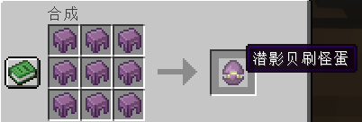
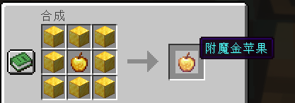
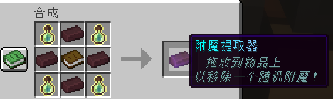
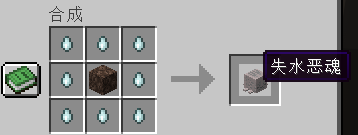
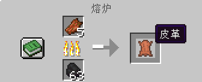

# 😊 服务器特殊配方

Stalir 增加了一些原版没有的合成与熔炼配方。请按照图片中的位置摆放材料；配方调整时，以游戏内实际显示为准。

## 工作台配方

### 潜影贝刷怪蛋

使用 8 个潜影壳合成 1 个潜影贝刷怪蛋。

### 附魔金苹果

使用 8 个金块围绕 1 个苹果，合成 1 个附魔金苹果。

### 附魔提取器

附魔提取器可以从物品上移除一个随机附魔。获得提取器后，请按照物品提示将它拖放到需要处理的物品上。

### 失水恶魂

使用 8 个恶魂之泪围绕 1 个灵魂沙，合成 1 个失水恶魂。

## 熔炉配方

### 腐肉烧制皮革

把腐肉放入熔炉烧制，可以获得皮革。

